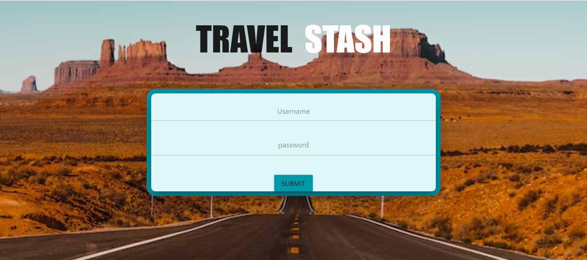
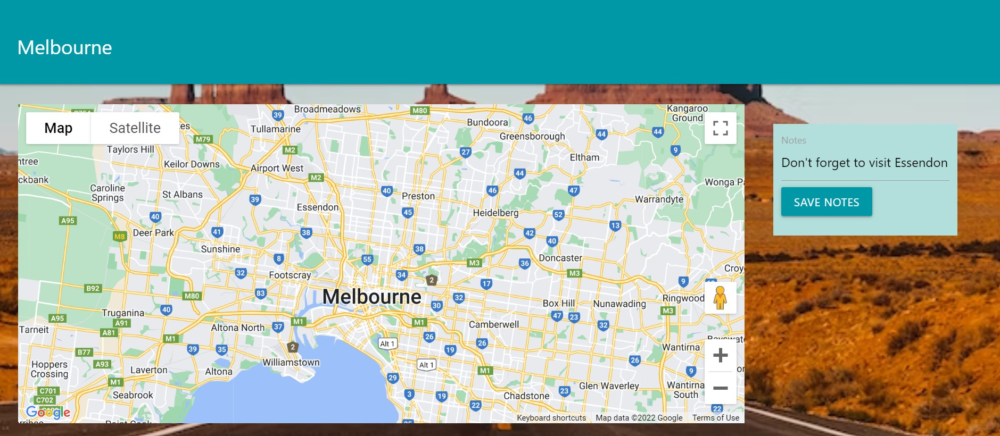
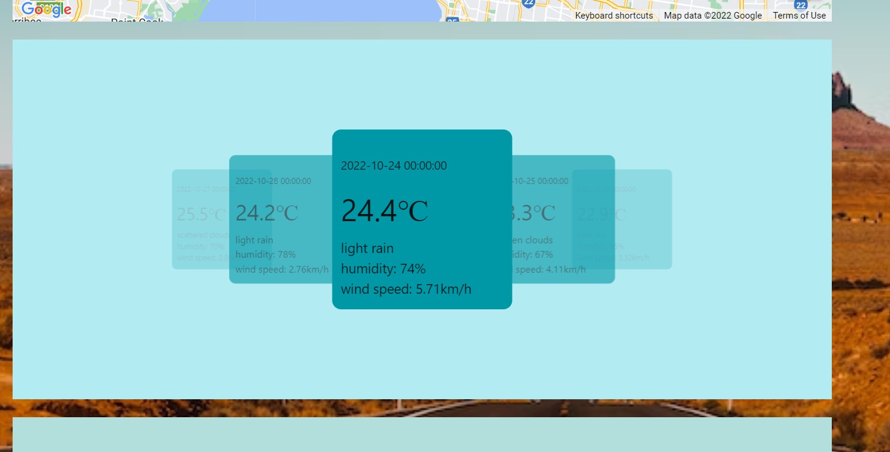
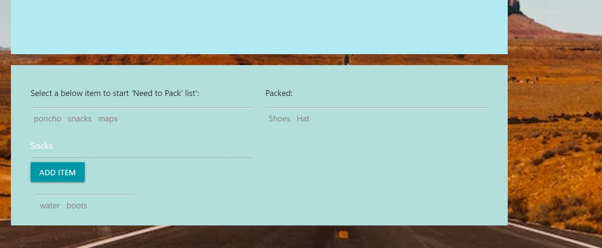

# Travel-Stash

## Description

This project was created to make planning for travel a quick and easy task, being able to have an all-in-one application where you can have a personalised log-in saving all your trips, access the location, the local weather and have your own adjustable packing list. The weather API used allows the user to see a 5 day forecast in the location selected, the map will give you an interactive map starting at your selected location & your personalised packing list, provides some default items but also the ability to add custom items, ensuring not to forget anything. 

## Usage

The project uses:
Personalised Login - Allows you to set a personal login.
Local Storage - Stores your trips information & additional notes.
A 5 day weather API - Captures the next 5 day forecast of your selelcted location.
A map API - Provides the user a map of the city that they are in or might be interested in exploring.
A packing list - This packing list offers the user to select default items and/or added items by the user, that may be helpful the trip and can adjust for the weather conditions of their location. The packing list has a 3 step system, making it easy to visually see what is wanted to be packed, what will be packed and what is packed leaving little chance of forgetting anything.
 

    ```md
    
    
    
    
    
    ```
https://github.com/Kokkonut/travel-stash
https://kokkonut.github.io/travel-stash/


## Credits

https://openweathermap.org/
https://materializecss.com/
https://stackoverflow.com/
https://developer.mozilla.org/
https://github.com/
https://mapsplatform.google.com/

BootCamp - University of Adelaide 
(Tutors and Instructors)


The collaborators, with links to their GitHub profiles.

Kokkonut
Nic Fraenkel

@jamdancle
Dan McCartney

@NebsterOne
Ned Zatezalo

@Ellekcir
Rickelle Griffith


